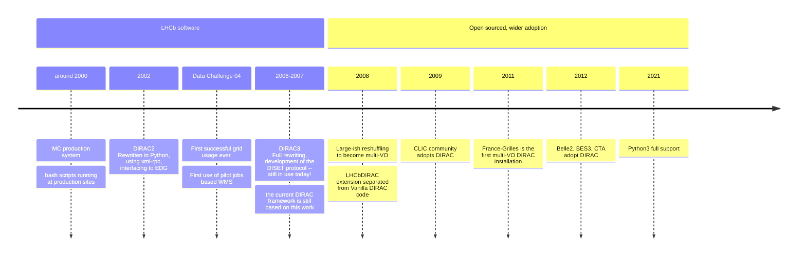
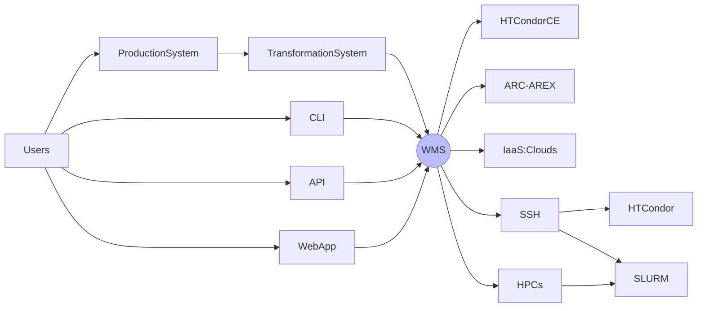
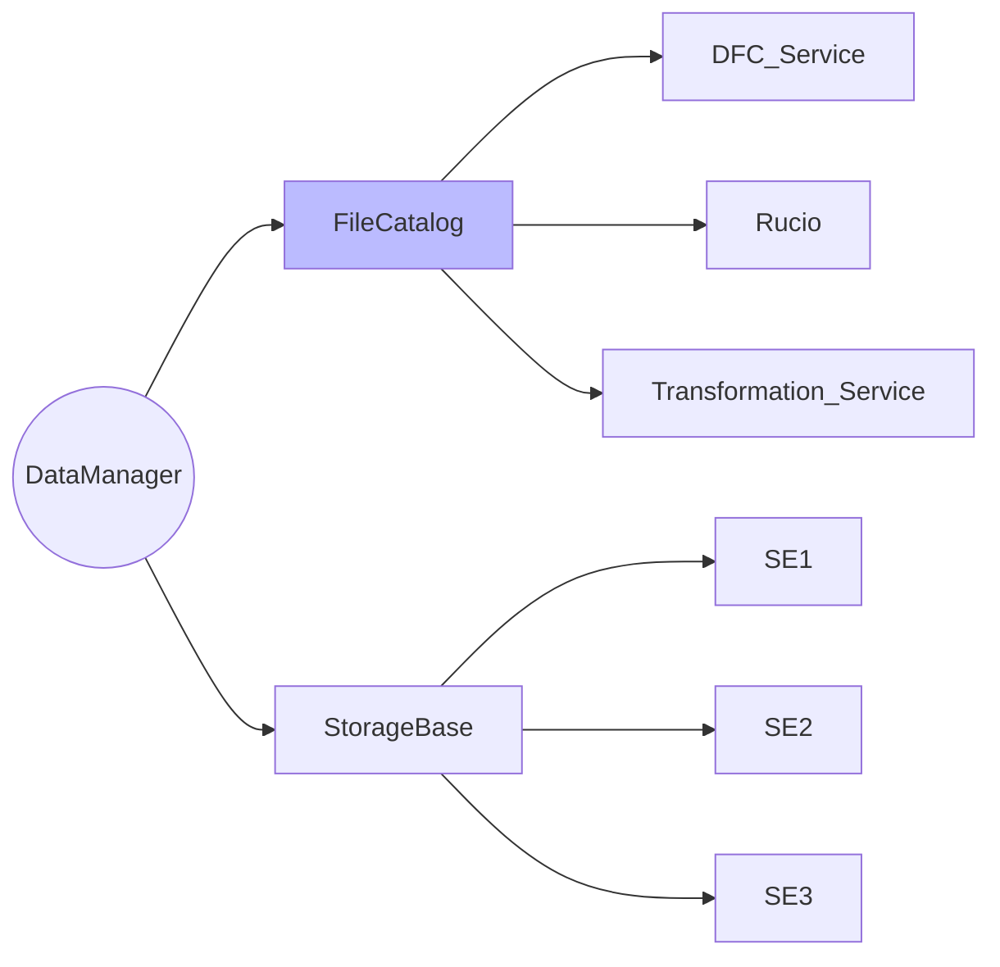
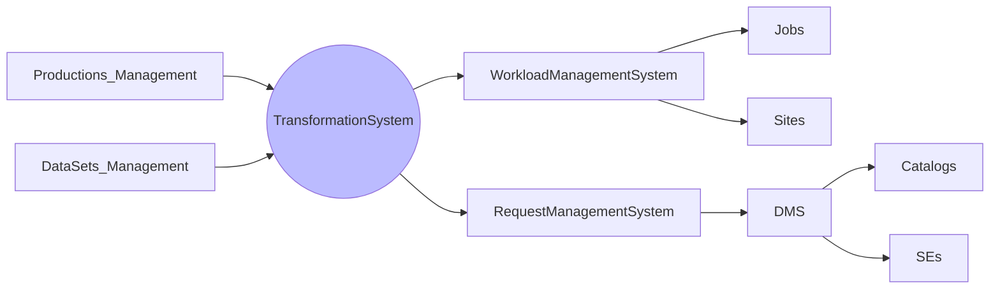
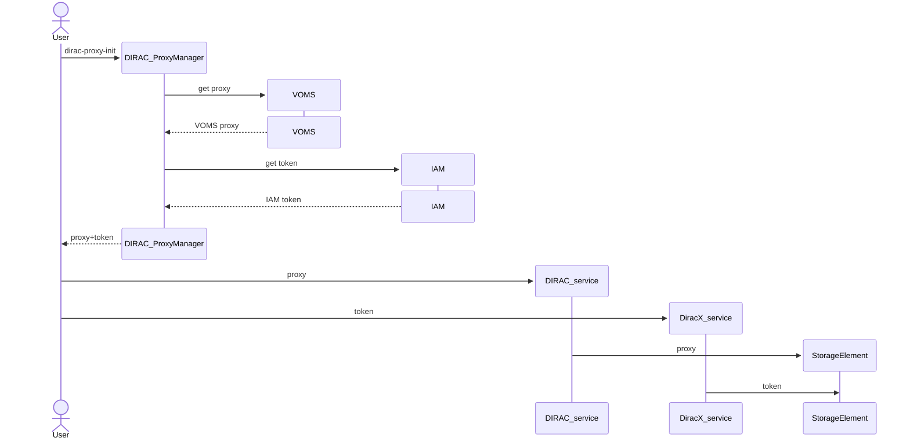
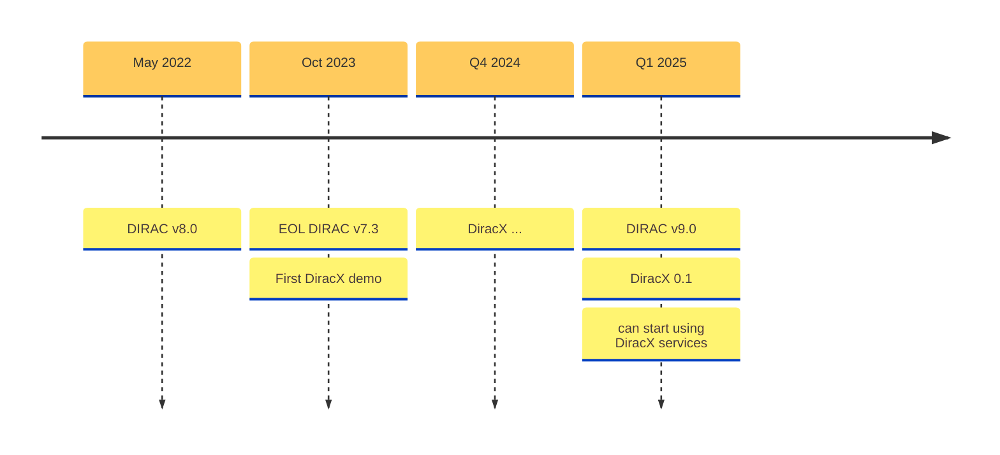

```mermaid {theme: 'neutral', scale: 0.5}
architecture-beta
    group common(db)[common]
    group DIRAC(server)[DIRAC]
    group DiracX(server)[DiracX]

    service db(devicon:sqldeveloper)[Database] in common
    service client(clarity:thin-client-solid)[Client] in DIRAC
    service dips(server)[DIPS] in DIRAC
    service fastapi(devicon:fastapi)[FastAPI] in DiracX
    service clientx(clarity:thin-client-line)[Client] in DiracX

    db:B -- T:dips
    db:B -- T:fastapi
    dips:B -- T:client
    fastapi:B -- T:clientx
```

# The neXt Dirac incarnation

**Federico Stagni** <Email v="federico.stagni@cern.ch" />

October 25th 2024
__ <a href="https://indico.cern.ch/event/1338689/" class="ns-c-iconlink"><mdi-open-in-new />CHEP 2024</a>  


---
layout: section
color: lime-light
---

## This is the story of why and how we decided to take a successful project, and rewrite it from scratch


---
layout: section 
color: lime-light
---

<div style="display: flex; align-items: center; justify-content: center;">
    
    <span style="margin: 0 50px;">--></span>
    
</div>


---
layout: section
color: cyan-light
---

## What is DIRAC?


---
layout: iframe-left
title: DIRAC
url: https://dirac.readthedocs.io/en/latest/
class: DIRAC
slide_info: false
color: gray-light
---

<div style="display: flex; flex-wrap: wrap; justify-content: space-around; gap: 20px;">
  
  
  
  
  
  
  
  
  
  
  
  
  
  
  
  
  
  
</div>


---
layout: top-title
color: gray-light
align: l
title: history
---

:: title ::

# DIRAC timeline

:: content ::




---
layout: side-title
align: lm-lm
color: gray-light
title: WMS
---

:: title ::

# WMS: Workload Management System
- Pull model based on Pilot jobs
- Also "Push" solution for HPCs that do not support pilots (because of limited internet access).
- Will integrate [CWL (Common Workflow Language)](https://www.commonwl.org) as a way of defining jobs (replacing JDL) --> see poster #217

:: content ::



---
layout: side-title
align: lm-lm
color: gray-light
title: DMS
titlewidth: is-5
---

:: title ::

# DMS: Data Management System
It’s about **files**:​ placing, replicating, removing files​

- there are **LFNs** (logical file names) → and users ONLY work with these​
- **LFNs** are registered in *catalog(s)​*
    - where are the LFNs? (in the DIRAC File Catalog (DFC), or in Rucio)​
    - what are their metadata? (in the DFC, or in the LHCb Bookkeeping, or in AMGA)​
- LFNs *may* have **PFNs**, stored in **SEs**, that can be accessed with several protocols.​

:: content ::




---
layout: side-title
color: gray-light
align: lm-lm  
title: TS
---

:: title ::

# Productions and Dataset management

- A *Data Processing* **transformation** (e.g. Simulation, Merge, DataReconstruction...) creates jobs in the WMS (and re-sumbit them, and destroy them).​

- A *Data Manipulation* **transformation** replicates, or remove, data from storage elements.

:: content ::

<span class="bg-cyan-100 text-cyan-600 p-4 border-l-6 border-2 border-cyan-400 rounded-lg pl-8 pr-8 w-full block">
    The Transformation System (TS) is used to automate common tasks related to production activities. It can handle thousands of productions, millions of files and jobs.
</span>

&nbsp;
&nbsp;



---
layout: top-title-two-cols
align: c-lm-lm
color: gray-light
title: tech
---


:: title ::

# Tech stack 

:: left :: 

- DIRAC is written in python3
  - with the exception of the DIRAC Pilot, which needs to still be able to run with Python2
- Services are exposed at urls like `dips://box.some.where:9132/WorloadManagement/`
  - `dips` stands for "DIRAC protocol"
- The DIRAC framework provides also "Agents" and "Executors" to animate the system
- As backends, MySQL and OpenSearch are supported (for different purposes)

:: right ::

DIRAC also provides a WebApp


Implemented using `ExtJS`, and fully custom Python "bindings"


---
layout: side-title
align: rm-lm
color: red
titlewidth: is-2
title: issues
--- 

:: title ::

# DIRAC issues

:: content ::

<ul class="list-image-none font-sans text-sm mx-auto">
    <li> complex, with high entrance bar</li>
    <li> somewhat cumbersome deployment</li>
    <li> late on “standards”
        <ul class="text-vs mx-auto">
            <li> http services</li>
            <li> tokens</li>
            <li> monitoring</li>
        </ul>
    </li>
    <li> “old”-ish design (RPC, “cron” agents…)</li>
    <li> not very developer-friendly: rather un-appealing/confusing, especially for new (and young) developers</li>
    <li> multi-VO, but was not designed to do so since the beginning</li>
    <li> no clear interface to a running DIRAC instance</li>
</ul>


---
layout: section
color: cyan-light
--- 

## DiracX,  the neXt DIRAC incarnation


---
layout: top-title-two-cols
color: gray-light
align: l-lm-lt
title: requirements
---

<StickyNote color="gray-light" textAlign="center" width="260px" title="Developers and maintainers requirements" v-drag="[350,380,320,100]">
Easy to test (will make it easier to code), but also modern, funny, and accessible to new developers
</StickyNote>


:: title ::

# Minimal Requirements

:: left ::

## Communities/Users requirements

- Ease of use, including ease of access
- Fast and responsive interfaces
- Scalable and flexible

:: right ::

## Administrator requirements

- Ease of installation and update
- Up-to-date documentation
- Clear confguration
- Ready-to-use dashboards

---
layout: side-title
side: left
color: gray-light
titlewidth: is-5
align: rm-lm
title: DiraX
---

:: title ::

# What is DiracX?

:: content ::

- A cloud native app
- Multi-VO from the get-go
- Standards-based
- Still DIRAC, in terms of functionalities


---
layout: iframe-right
title: Web API
url: https://diracx-cert.app.cern.ch/api/docs
class: webAPI
slide_info: false
color: gray-light
---

# DiracX Web API

<devicon-fastapi-wordmark />
<devicon-swagger-wordmark />

<ul class="list-image-none font-sans text-sm mx-auto">
  <li>DIRAC Web APIs are developed using  FastAPI <span class="iconify" data-icon="devicon:fastapi-wordmark" data-inline="true"></span></li>
  <li>Nicely documented in Swagger (or Redoc), this what you see on the right <span class="iconify" data-icon="devicon:swagger-wordmark" data-inline="false"></span></li>
</ul>


&nbsp;
&nbsp;

<AdmonitionType type='caution' >
What is on the right is the certification Web API, loaded live. Use with caution!
</AdmonitionType>

---
layout: side-title
side: left
color: gray-light
titlewidth: is-2
align: rm-lt
title: CLI
---


:: title ::

# <mdi-code-braces /> CLI

:: content ::

Scrollable with clicks 🤯

```python {2|3|7|12}{maxHeight:'100px'}
function helloworld() {
  console.log('Hello, World 1!')
  console.log('Hello, World 2!')
  console.log('Hello, World 3!')
  console.log('Hello, World 4!')
  console.log('Hello, World 5!')
  console.log('Hello, World 6!')
  console.log('Hello, World 7!')
  console.log('Hello, World 8!')
  console.log('Hello, World 9!')
  console.log('Hello, World 10!')
  console.log('Hello, World 11!')
}

```

You can even edit the code in the browser

```ts {monaco}
console.log('HelloWorld')
```

You can even run the code in the browser

```sh
curl -X 'GET' \
  'https://diracx-cert.app.cern.ch/api/jobs/status?job_ids=123' \
  -H 'accept: application/json'
```

<SpeechBubble position="t" color='orange' shape="round" maxWidth="300px">
**REST API**, so use your own language
</SpeechBubble>


---
layout: iframe-left
title: WebApp
url: https://diracx-cert.app.cern.ch
class: webapp
slide_info: false
color: gray-light
---

# DiracX web

We are also rewriting the WebApp from scratch.

Software stack:
- NextJS
- Material UI
- TypeScript

https://github.com/DIRACGrid/diracx-web

&nbsp;

<AdmonitionType type='caution' >
What is on the left is the certification WebApp, loaded live. Use with caution!
</AdmonitionType>

---
layout: default
color: gray-light
---

# Architecture diagram


---
layout: quote
color: sky-light
quotesize: text-m
authorsize: text-s
author: 'Some of you out there'
---

"OK, but the Grid still uses proxies. 

VOMS is alive!"

---
layout: top-title
color: gray-light
align: lm
title: tokens
---

:: title ::

# What are proxies and/or tokens needed for?

:: content ::

- **Submitting pilots** : The computing elements right now prefer the tokens (DIRAC v8 does that already)
- **Data access** : proxies. One day, will be token
- **Verifying a user's identity** : 
    - **DIRAC** uses only X509 proxies and certificates to verify identities 
    - **DiracX** uses only tokens
    - --> For a (long) while, **users will have both a token and proxy**.

<AdmonitionType type='Note' >
DiracX delivers its own tokens, they are not the same tokens used for the Grid endpoints
</AdmonitionType>

---
layout: top-title
color: gray-light
align: lm
title: interactions
---

:: title ::

# On proxies and tokens/2

:: content ::




---
layout: quote
color: sky-light
quotesize: text-m
authorsize: text-s
author: 'Again, some of you out there'
---

"OK, but there are several communities using DIRAC right now.

What should they do?"

---
layout: side-title
color: gray-light
align: lm-lm
title: Migration
---

:: title ::

# Migration from DIRAC

- Business continuity for DIRAC communities is our top priority:
    - DIRAC and DiracX share the databases
    - at the moment, it is not possible to run DiracX standalone
    - DIRAC v9 and DiracX will need to live together for some time


:: content ::



---
layout: top-title
color: gray-light
align: l
title: Extensions
---

:: title ::

# On extending DiracX

:: content ::


Dirac has to support different Communities with different workflows and requirements. Examples:
<ul class="text-sm">
  <li>LHCb stores the metadata and provenance of every produced file in a LHCb-specific database (with an Oracle backend)
    <ul class="text-xs ml-4">
      <li>--> <a href="https://indico.cern.ch/event/1338689/contributions/6010069/" class="text-blue-600 hover:underline">see talk in Track 3 on Monday</a></li>
      <li>--> See also poster #461 on <code>LbMCSubmit</code> tool</li>
    </ul>
  </li>
  <li>Belle2 is a HEP experiment. Uses Rucio as a data management solution.
    <ul class="text-xs ml-4">
      <li>--> <a href="https://indico.cern.ch/event/1338689/contributions/6010888/" class="text-blue-600 hover:underline">see talk in Track 1 this afternoon</a></li>
    </ul>
  </li>
  <li>CTAO has radically different requirements (compared to HEP experiments) on how to process its data.
    <ul class="text-xs ml-4">
      <li>--> <a href="https://indico.cern.ch/event/1338689/contributions/6011028/" class="text-blue-600 hover:underline">see talk in Track 4 tomorrow</a></li>
    </ul>
  </li>
  <li>HERD is an astronomy and particle astrophysics experiment using dHTC for data management.
    <ul class="text-xs ml-4">
      <li>--> <a href="https://indico.cern.ch/event/1338689/contributions/6011011/" class="text-blue-600 hover:underline">see talk in Track 4 tomorrow</a></li>
    </ul>
  </li>
  <li>EGI uses DIRAC as WMS, and EGI-CheckIn as an identity provider.</li>
  <li>WeNMR brings together complementary research teams in the structural biology and life science area.</li>
</ul>

<span class="bg-cyan-100 text-cyan-600 p-4 border-l-6 border-2 border-cyan-400 rounded-lg pl-8 pr-8 w-full block">
    It is sometimes necessary to extend all Dirac(X) components (including Web and Pilot). DiracX aims to provide an easy way to do so.
</span>


---
layout: top-title
color: gray-light
align: l
title: Versions
---

:: title ::

# Versions

:: content ::



<SpeechBubble position="r" color='cyan' shape="round"  v-drag="[20,211,148,240]">
Current production and only supported version, used by all DIRAC installations
</SpeechBubble>


<SpeechBubble position="l" color='amber' shape="round"  v-drag="[820,265,140,175]">
DIRAC v9 and DiracX 0.1 will be released together.
</SpeechBubble>


---
layout: side-title
color: gray-light
title: Contribute
align: cm-lm
titlewidth: is-3
---

:: title ::

# *"I want to contribute"*

:: content ::

## The obvious ways:

- tests: (as you could see we have a somewhat open test deployment infrastructure). You *can* try something out, and let us know!
- code: https://github.com/DIRACGrid/diracx

## Run the demo: 

```sh
git clone https://github.com/DIRACGrid/diracx-charts
diracx-charts/run_demo.sh  # do not do it now!
```

&nbsp;

## Discuss:
- **mattermost** : https://mattermost.web.cern.ch/diracx/
- **meetings**: (almost) every week on Thursday morning (CET)
- **hackathons**: we have been doing 2-days DiracX hackathons every quarter. At CERN. [Next one in January](https://indico.cern.ch/event/1458873/)


---
layout: top-title-two-cols
align: cm-cm-lm
color: orange-light
titlewidth: is-5
title: summary
--- 
:: title ::

# Summary

:: left :: 

 </img>

:: right ::

### DiracX is in active development
- It will live together with DIRAC v9 for a while
- Foundations are there, the first release will soon be here
- We plan to ease the interoperability with Rucio
    - DiracX will still have the Data Management part, but WMS will come first


---
layout: credits
color: navy
loop: true
speed: 0.4
---

<div class="grid text-size-4 grid-cols-3 w-3/4 gap-y-10 auto-rows-min ml-auto mr-auto">
    <div class="grid-item text-center mr-0- col-span-3">
        <strong>People</strong><br> 
    </div>
    <div class="grid-item text-right mr-4 col-span-1">
        <strong>DiracX is an idea of</strong>
    </div>
    <div class="grid-item col-span-2">
        Chris Burr <i>CERN, LHCb</i><br/>
        Christophe Haen <i>CERN, LHCb</i>
    </div>
    <div class="grid-item text-right mr-4 col-span-1">
        <strong>Current Developers</strong>
    </div>
    <div class="grid-item col-span-2">
        Alexandre Boyer <i>CERN, LHCb</i><br/>
        Natthan Piggoux <i>LUPM (FR), CTA</i><br/>
        Cedric Serfon <i>Brookhaven National Laboratory (US), Belle2</i><br/>
        Ryunosuke O'Neil <i>CERN, LHCb</i><br/>
        Jorge Lisa Laborda <i>Univ. of Valencia and CSIC (ES), LHCb</i><br/>
        Janusz Martyniak <i>Imperial college (UK), GridPP</i><br/>
        Bertrand Rigaud <i>IN2P3 (FR)</i>
    </div>
    <div class="grid-item text-right mr-4 col-span-1">
        <strong>Project lead</strong>
    </div>
    <div class="grid-item col-span-2">
        Federico Stagni <i>CERN, LHCb</i><br/>
        Andrei Tsaregorotsev <i>CPPM (FR), EGI and LHCb</i>
    </div>
</div>

&nbsp;
&nbsp;
&nbsp;
&nbsp;
&nbsp;
&nbsp;


<div class="grid-item col-span-3 text-center mt-180px mb-auto font-size-1.5rem">
    <strong>Questions?</strong>
</div>


---
layout: side-title
align: rm-lm
color: light
titlewidth: is-5
title: QR
--- 

:: title ::

# QR codes for your fun

# <mdi-arrow-right />

:: content ::

WebApp:

<QRCode value="https://diracx-cert.app.cern.ch" :size="180" render-as="svg" />

<br />

WebAPI:

<QRCode value="https://diracx-cert.app.cern.ch/api/docs" :size="180" render-as="svg" />

<br />


---
layout: section
color: cyan-light
align: r
---

## Backup

---
layout: top-title
color: gray-light
align: l
title: FAQ
---

:: title :: 

Q/A

:: content ::

- I am using Rucio. I could use DiracX as WMS but do not want to fiddle with DIRAC

--> It will probably be possible, but we do not know when.

- ?
